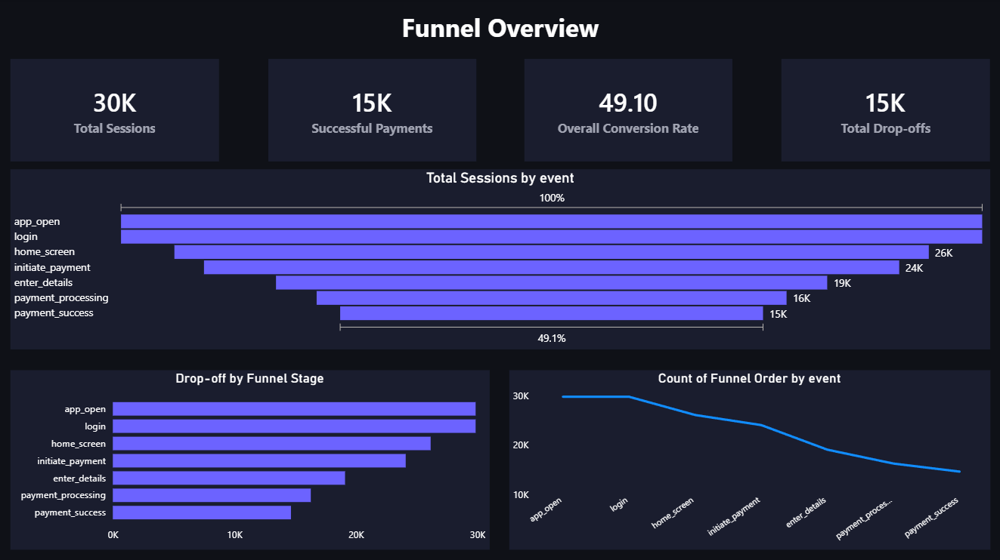
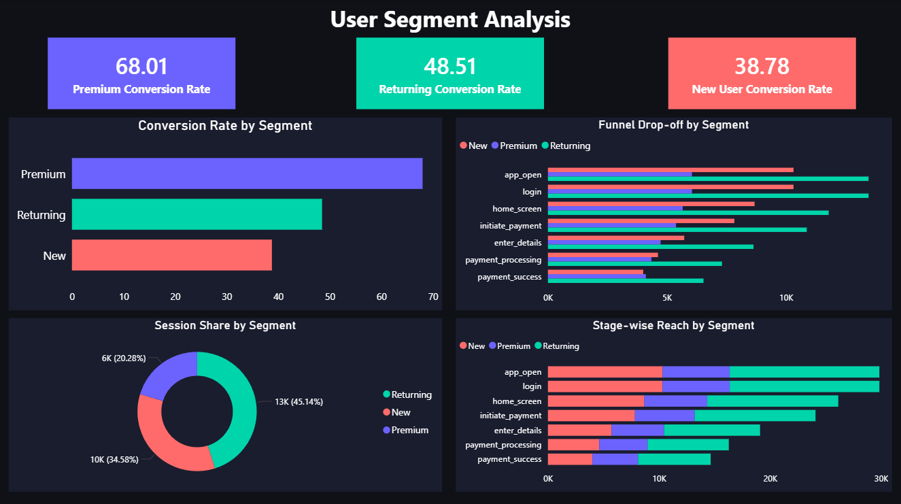
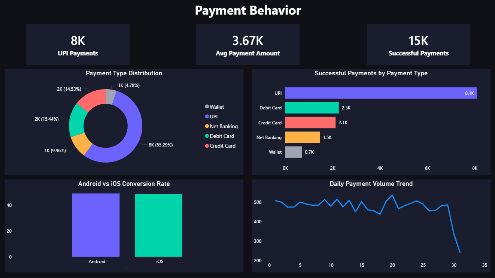
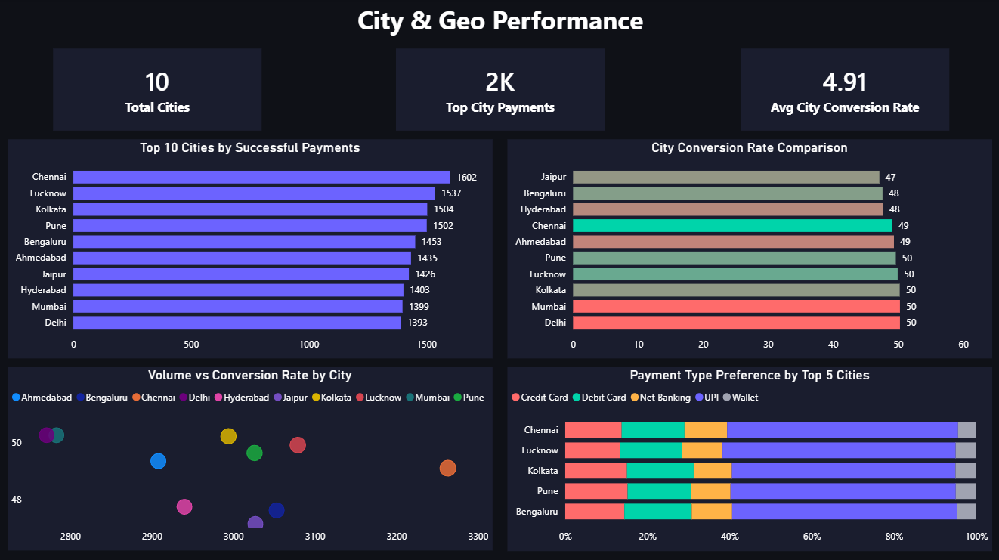

# 💳 PayFlow Funnel Intelligence

> **Session-level funnel analysis and behavioral segmentation for a fintech payments app**  
> Uncovering where users drop off, why conversion gaps exist, and which segments drive payment success.

---

## 📌 Project Overview

PayFlow Funnel Intelligence is an end-to-end data analytics project simulating real-world user behavior on a PhonePe/Paytm-style fintech payments app. The project analyzes **160,000+ event logs across 29,844 sessions** to map the complete payment funnel, identify critical drop-off points, and segment users by behavior, device, payment preference, and geography.

The goal: surface actionable insights that a product or growth team could use to improve conversion rates and reduce funnel friction.

---

## 🗂️ Project Structure

```
payflow-funnel-intelligence/
│
├── data/
│   └── fintech_funnel_events.csv       # Synthetic dataset (160K+ records)
│
├── sql/
│   ├── 01_funnel_stage_counts.sql
│   ├── 02_stage_conversion_rates.sql
│   ├── 03_overall_conversion.sql
│   ├── 04_dropoff_per_stage.sql
│   ├── 05_segment_conversion.sql
│   ├── 06_device_conversion.sql
│   ├── 07_payment_type_distribution.sql
│   ├── 08_time_to_conversion.sql
│   ├── 09_fast_vs_slow_converters.sql
│   └── 10_city_wise_performance.sql
│
├── dashboard/
│   └── payflow_dashboard.pbix          # Power BI Dashboard (4 pages)
│
└── README.md
```

---

## 🧰 Tech Stack

| Tool | Purpose |
|---|---|
| **PostgreSQL** | Database, SQL analysis |
| **Power BI** | Dashboard & data visualization |
| **Python (Pandas, NumPy)** | Synthetic dataset generation |
| **pgAdmin** | Database management |

---

## 📊 Dataset

The dataset simulates a fintech payments app with the following schema:

| Column | Description |
|---|---|
| `session_id` | Unique session identifier |
| `user_id` | Unique user identifier |
| `event` | Funnel stage name |
| `event_status` | Status of the event |
| `timestamp` | Event timestamp |
| `device` | Android or iOS |
| `segment` | New / Returning / Premium |
| `city` | Indian city (10 cities) |
| `age` | User age |
| `payment_type` | UPI / Debit Card / Credit Card / Net Banking / Wallet |
| `amount` | Transaction amount (₹) |
| `reached_success` | Binary flag — 1 if session completed payment |

**Dataset stats:**
- 📁 160,000+ event records
- 👤 10,000 unique users
- 🔁 29,844 unique sessions
- 📅 Jan 2024 – Jun 2024
- 🏙️ 10 Indian cities

---

## 🔁 Funnel Stages

```
App Open → Login → Home Screen → Initiate Payment → Enter Details → Payment Processing → Payment Success
```

---

## 🔍 SQL Analysis — 10 Queries

| # | Query | Insight |
|---|---|---|
| 1 | Funnel Stage Counts | Volume at each stage |
| 2 | Stage-wise Conversion Rate | % proceeding to next stage |
| 3 | Overall Funnel Conversion | App open → Payment success % |
| 4 | Drop-off Count Per Stage | Where users are leaving |
| 5 | Segment-wise Conversion | New vs Returning vs Premium |
| 6 | Device-wise Conversion | Android vs iOS |
| 7 | Payment Type Distribution | Among successful payments |
| 8 | Time-to-Conversion Per Stage | Avg seconds between stages |
| 9 | Fast vs Slow Converters | Session duration segmentation |
| 10 | City-wise Payment Success | Top performing cities |

---

## 📈 Key Findings

### 🔻 Funnel Conversion
| Stage | Sessions | Conversion Rate |
|---|---|---|
| App Open | 29,844 | — |
| Login | 29,844 | 100.00% |
| Home Screen | 26,144 | 87.60% |
| Initiate Payment | 24,093 | 92.15% |
| Enter Details | 19,102 | **79.28% ⚠️** |
| Payment Processing | 16,285 | 85.25% |
| Payment Success | 14,654 | 89.98% |

> **Enter Details is the biggest drop-off stage — 4,991 sessions lost here.**

---

### 👥 Segment Performance
| Segment | Sessions | Successful Payments | Conversion Rate |
|---|---|---|---|
| Premium | 6,052 | 4,116 | **68.01%** |
| Returning | 13,473 | 6,536 | 48.51% |
| New | 10,319 | 4,002 | 38.78% |

> Premium users convert at **nearly 2x the rate** of new users.

---

### 💳 Payment Type Distribution
| Payment Type | Successful Payments | Share |
|---|---|---|
| UPI | 8,102 | **55.29%** |
| Debit Card | 2,262 | 15.44% |
| Credit Card | 2,129 | 14.53% |
| Net Banking | 1,460 | 9.96% |
| Wallet | 701 | 4.78% |

---

### 🏙️ Top Cities by Payment Volume
| Rank | City | Successful Payments | Conversion Rate |
|---|---|---|---|
| 1 | Chennai | 1,602 | 49.10% |
| 2 | Lucknow | 1,537 | 49.92% |
| 3 | Kolkata | 1,504 | 50.23% |
| 4 | Pune | 1,502 | 49.64% |
| 5 | Bengaluru | 1,453 | 47.59% |

---

## 📊 Power BI Dashboard — 4 Pages

| Page | Title | Key Visuals |
|---|---|---|
| 1 | Funnel Overview | Funnel chart, KPI cards, drop-off bar, conversion line |
| 2 | User Segment Analysis | Segment conversion bars, donut, stage-wise funnel by segment |
| 3 | Payment Behavior | Payment type donut, device comparison, daily volume trend |
| 4 | City & Geo Performance | City bar chart, conversion heatmap, scatter plot, payment preference |

**Theme:** Dark UI (`#0F1117` background) with purple-blue (`#6C63FF`) and teal (`#00D4AA`) accents — designed to reflect real fintech product aesthetics.

## 🖼️ Dashboard Preview

### Page 1 — Funnel Overview


### Page 2 — User Segment Analysis


### Page 3 — Payment Behavior


### Page 4 — City & Geo Performance


---

## 💡 Business Recommendations

1. **Reduce friction at Enter Details stage** — 4,991 sessions dropped here. Simplify the form, enable UPI autofill, or add a progress indicator to reduce abandonment.
2. **Target New users with onboarding nudges** — New users convert at only 38.78% vs 68% for Premium. A guided first-payment experience could significantly lift this.
3. **Double down on UPI** — 55.29% of successful payments use UPI. Prioritize UPI-first flows and fast-pay features.
4. **Focus growth efforts on Chennai & Lucknow** — Highest payment volumes with healthy conversion rates.
5. **Investigate slow-converting sessions** — Sessions >5 minutes convert at 95% vs 0.40% for fast sessions, indicating engaged users complete payments but need more time. Avoid session timeouts for these users.

---

## 🚀 How to Run

**1. Set up PostgreSQL database**
```sql
CREATE DATABASE fintech_funnel;
```

**2. Create the table**
```sql
CREATE TABLE fintech_funnel_events (
    session_id      VARCHAR(20),
    user_id         VARCHAR(20),
    event           VARCHAR(30),
    event_status    VARCHAR(20),
    timestamp       TIMESTAMP,
    device          VARCHAR(10),
    segment         VARCHAR(20),
    city            VARCHAR(30),
    age             INT,
    payment_type    VARCHAR(20),
    amount          NUMERIC(10,2),
    reached_success INT
);
```

**3. Load the dataset**
```bash
\copy fintech_funnel_events FROM 'path/to/fintech_funnel_events.csv' DELIMITER ',' CSV HEADER;
```

**4. Run SQL queries**  
Execute queries from the `/sql` folder in order (01 through 10).

**5. Open Power BI Dashboard**  
Open `payflow_dashboard.pbix` in Power BI Desktop and refresh the data source to point to your local CSV.

---

## 👤 Author

**Shanmukha Sasank Nandula**  
Data Analyst | Python • SQL • Power BI  
[LinkedIn](https://linkedin.com/in/sasank-nandula) • [GitHub](https://github.com/ShanmukhaSasank)

---

*This project uses a synthetically generated dataset created for portfolio and analytical demonstration purposes.*
